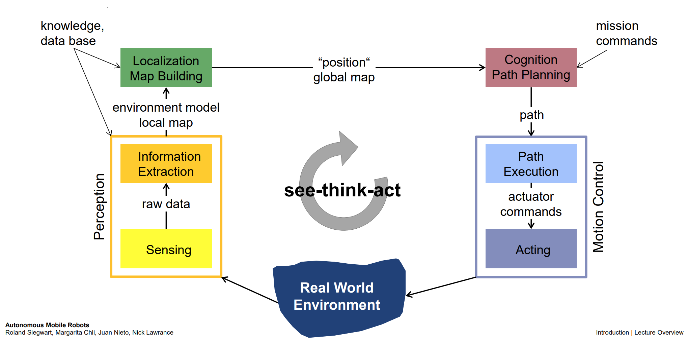
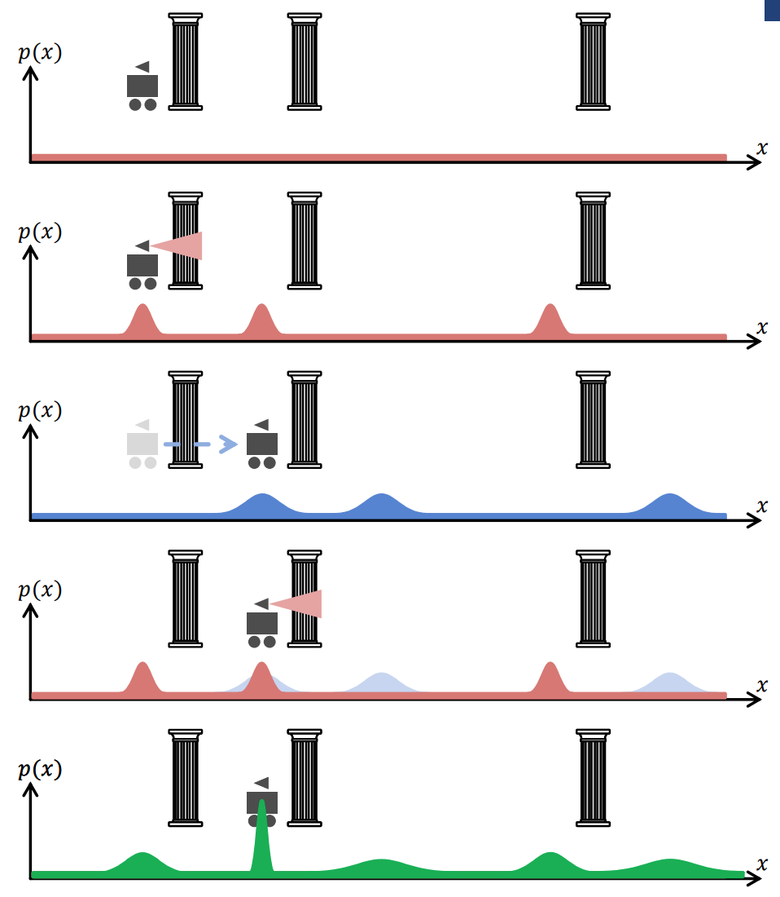

# Introduction

## ETH-Zurich AMR Course [[src]](https://courses.edx.org/courses/course-v1:ETHx+AMRx+1T2018/course/)
- Autonomous Mobile Robot: 3 Key Questions
    - Where am I?
    - Where am I going?
    - How do I get there?
- To answer these questions, robot has to:
    - have model of env (generated or pre-built)
    - perceive and analyze env
    - find its position/situation within that env
    - plan appropriate movement
    - execute movement
- See-Think-Act Cycle
    - 
    - perceive -> localize -> cognition (path planning) -> motion (actuation)
- See (Perception)
    - Sensors
        - Internal sensors (IMU, etc)
        - External (Lidar, Cameras, GPS, etc)
        - consider Signal-to-Noise ratios of various sensors and associated challenges/tradeoffs
    -  Info Extraction
        - filtering/edge detection
        - Keypoint Features - identification & matching
            - features that are invariant to transformations (gradient)
            - useful for comparing different images, across time and angles
- See -> Think (Localization)
    - compare to knowledge base (map)
    - 
    - probabilistic localization
- Think (Planning)
    - where am I going and how do I get there?
    - _best_ path, not just _a_ path
    - global path planning (graph-search) vs. local path planning (collision avoidance)
    
- Act (Motion Control)
    - wheels? rolling or no-sliding constraints?
    - represent the motion of the robot as a function of the motion of its actuators (e.g. wheels) and other geometric factors
    - also, other way: given the speeds of the wheels, et al, what is the state (x_dot, y_dot, theta_dot) of the robot (~ dead-reckoning)