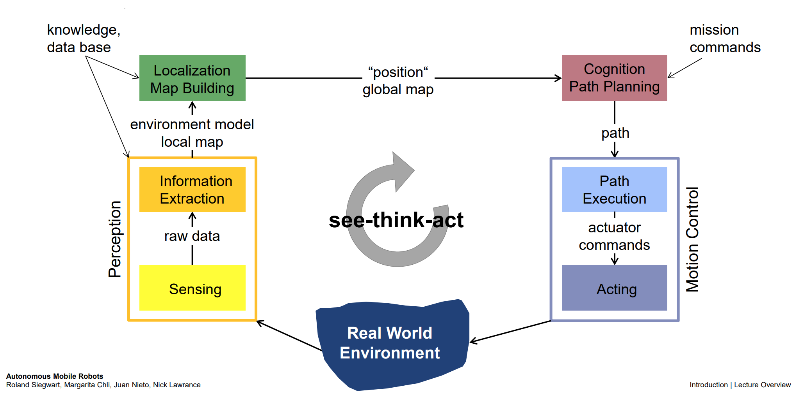

# Lecture 1: Introduction

## Organizational Notes

### What is a Robot?

##### Examples

Start with this question of "what is a robot" and build off it -- you can first show examples of fictional concepts of robot and then move on to real-world examples...

Introduce the examples as a way to establish what a robot is -- how does pop culutre perceive robots? What characteristics are common across different representations? What examples of robots exist in the real world?

##### Types
- Manufacturing Robots
    - Arm-type robot, fixed base
    - Local, repetitive tasks
- Service Robots
    - Medical, cleaning, etc.
- Field Robots
    - Moves in complex, cluttered, changing environments
    - Military, security ops
    - Self-driving cars, Drones, etc.
- Humanoids

##### History of Robotics

- Ancient Times: concepts, simple mechanical designs
- 1495: Leonardo da Vinci’s Mechanical Knight
- 1738: Jacques de Vaucanson’s Mechanical Duck
- 1898: Nikola Tesla’s remote-controlled vessel
- 1921: “Robot” coined by Karel Čapek in play “Rossum’s Universal Robots”
    - “robot”  Slavic “robota”  “worker”
- 1942: Isaac Asimov’s 3 Laws of Robotics
    1. Robot may not injure a human being (or by inaction, allow harm)
    2. Robot must obey human orders (unless conflict with 1)
    3. Robot must protect its own existence (unless conflict with 1 and 2)
- 1961: George Devol’s first patent of robot
    - Mechanical arm with gripper  industrial robotics
- 1966-72: Shakey the Robot
    - First general-purpose robot to be able to reason about its actions
    - Stanford Research Institute
- 2004: DARPA Grand Challenge
    - 150 miles in Mojave desert
    - Farthest distance? 
    - 7.32 miles (CMU)… Epic Fail!
- 2005: DARPA Grand Challenge
    - 5 finalists completed the course!
    - Winner: Stanford’s “Stanley”
    - feat. UVA’s Team Jefferson!
- 2007: DARPA Urban Challenge
    - Winner: CMU’s “Boss”
    - Video: https://www.youtube.com/watch?v=4hFhl0Oi8KI

##### Definition
- Dictionary definition of "robot"... wrong!!!
- better:
    > “a robot is a goal-oriented machine that can sense, plan and act”
- use this definition to transition into a discussion of the See-Think-Act Cycle

### See-Think-Act Cycle
- adopt from the ETH-Zurich class notes below

---

## Other Helpful Resources

### ETH-Zurich AMR Course -- 1st Lecture Notes [[src]](https://courses.edx.org/courses/course-v1:ETHx+AMRx+1T2018/course/)
- Autonomous Mobile Robot: 3 Key Questions
    - Where am I?
    - Where am I going?
    - How do I get there?
- To answer these questions, robot has to:
    - have model of env (generated or pre-built)
    - perceive and analyze env
    - find its position/situation within that env
    - plan appropriate movement
    - execute movement
- See-Think-Act Cycle
    - 
    - perceive -> localize -> cognition (path planning) -> motion (actuation)
- See (Perception)
    - Sensors
        - Internal sensors (IMU, etc)
        - External (Lidar, Cameras, GPS, etc)
        - consider Signal-to-Noise ratios of various sensors and associated challenges/tradeoffs
    -  Info Extraction
        - filtering/edge detection
        - Keypoint Features - identification & matching
            - features that are invariant to transformations (gradient)
            - useful for comparing different images, across time and angles
- See -> Think (Localization)
    - compare to knowledge base (map)
    - 
    - probabilistic localization
- Think (Planning)
    - where am I going and how do I get there?
    - _best_ path, not just _a_ path
    - global path planning (graph-search) vs. local path planning (collision avoidance)
    
- Act (Motion Control)
    - wheels? rolling or no-sliding constraints?
    - represent the motion of the robot as a function of the motion of its actuators (e.g. wheels) and other geometric factors
    - also, other way: given the speeds of the wheels, et al, what is the state (x_dot, y_dot, theta_dot) of the robot (~ dead-reckoning)
