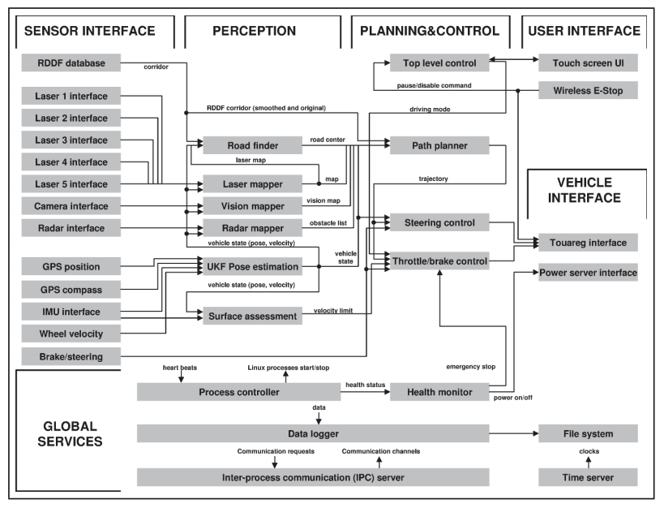
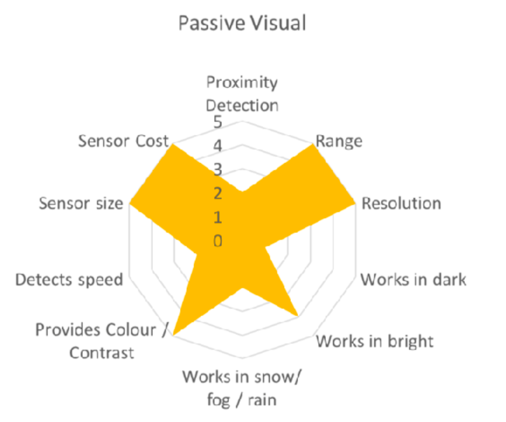
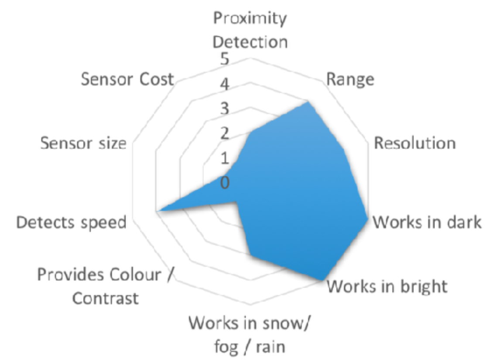
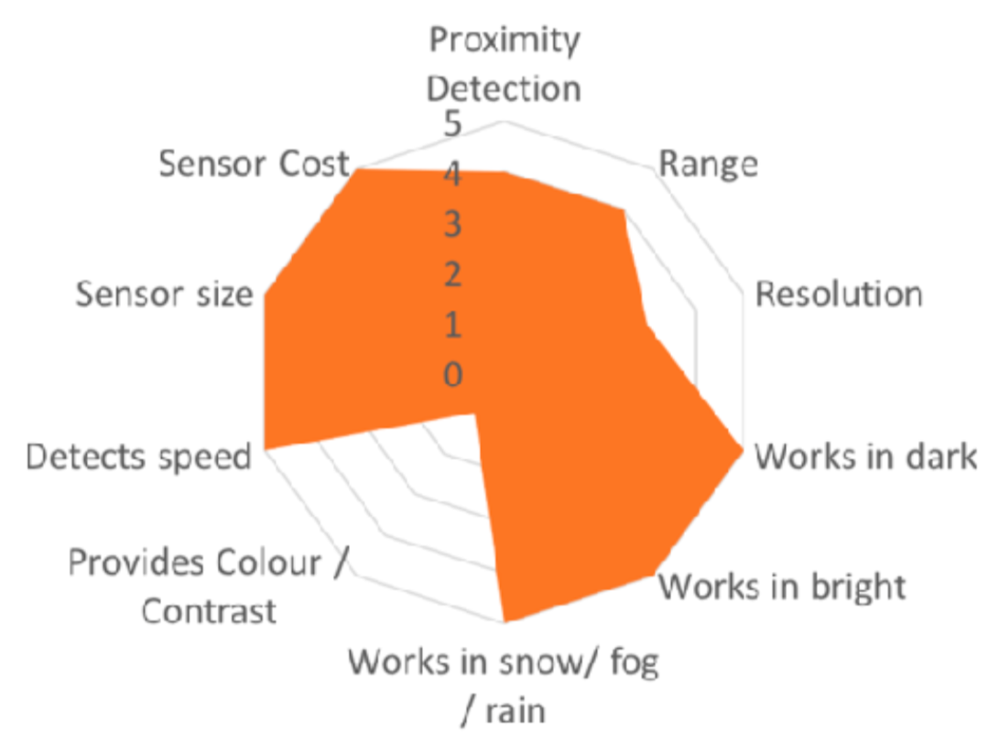
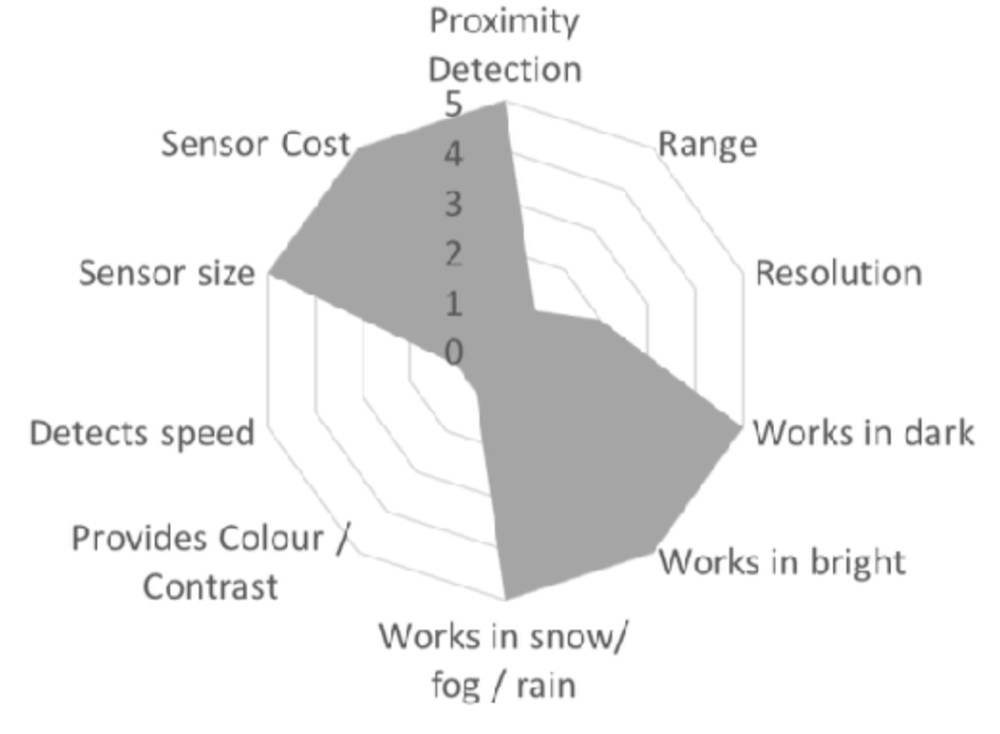
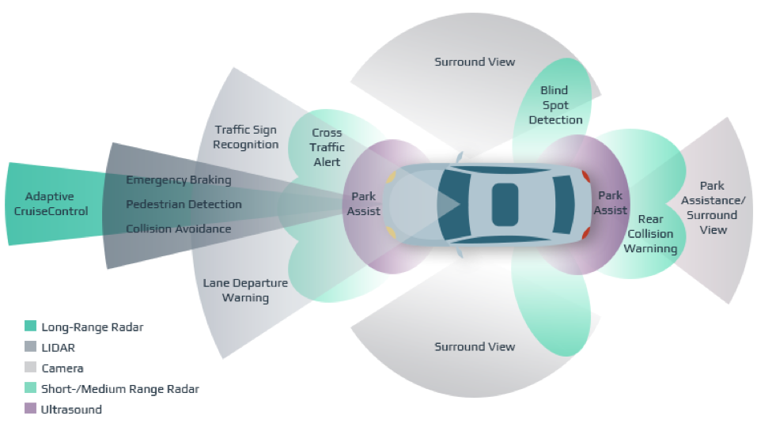
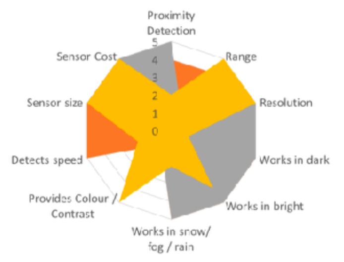

# Lecture 2: Sensors

## Agenda
- Housekeeping tasks
- Discuss sensors used for robotics and understand how each works
- Explore pros/cons of different sensors

---

## Organizational Notes

### Housekeeping
- Does everyone have Collab/website access
- Is there a better way to do quizzes? Maybe thru Collab?
- Lecture Feedback
    - Are lectures too technical? Are we moving too fast? Encourage students to give more feedback, possibly using the Collab Anonymous Feedback tool
    - Re-explain that the intention behind this course is to provide a gentle intro to this awesome field... _not_ to inundate students with obscure theories, math and jargon! Assume everyone is taking course because of some interest in learning about robotics (not because it's an "easy A") -- I want to cultivate that interest further, not dampen it!

### Recap of Last Time...
- See-Think-Act Cycle
    - Introduce a real-world example
    

### Sensors Overview
- Need sensors to interact and gain data from outside environment
-  Sensors are those components of the robot that provide measurements
    - Measurements: A measurement provides information about the state of the system.
    - State: (x, y, theta) in 2D space
- Definitions
    - Robot = sensors + actuators
    - Sensors = components that provide measurements
    - Measurement = information about the state of a system
    - State = “whatever we care about”… parameters of interest
        - Pose
        - Other objects
- How human sensors map to robot sensors

#### Types of Sensors
- Passive vs Active
    - __Passive__: measure energy coming to the sensor from the environment
    - __Active__: emit energy and measure the reaction of the environment
- External vs Internal
    - __External__: Measures information from the robot’s environment
        - Measures state of world with respect to robot
        - E.g. distances to objects, features of images,… 
        - Job security: “Exteroceptive”
    - __Internal__: Measures values internally to the robot
        - Measures state of robot itself
        - E.g. motor speed, heading, wheel revolutions,… 
        - Job security: “Proprioceptive”

### Camera
- Passive, exteroceptive
- Computer Vision
    - Object Recognition
    - Segmentation
    - Classification
- Metrics:
    - Resolution
    - Field of View
    - Dynamic Range
- Stereo cameras = better depth estimation!

#### Pros
- Cheap
- Very high resolution
- Lots of data = lots of learning!
- Like how humans see (intuitive)

#### Cons
- Bad at Depth Estimation
- Bad in extreme weather (rain, fog, etc)

### LiDAR
- Light Detection And Ranging
- Active, exteroceptive
- Measuring _time of flight_

- Output = __Point Cloud__

- Metrics
    - Number of Beams
    - Points per Second
    - Rotation Rate (Hz)
    - Field of View
- Applications
    - Agriculture
    - Archaeology
    - Geology
    - Conservation and Forestry
    - Astronomy (distance to moon!)
    - Surveying and Atmospheric Science
    - Law Enforcement
- Lidar visualization: https://www.youtube.com/watch?v=nXlqv_k4P8Q

####  Pros
- VERY accurate depth information
- Good Resolution
- Long Range (400m-ish)
- Large Field of View (360°)

#### Cons
- Expensive!!
- Commercial-grade LiDAR can cost upwards of… $75,000!
- Reflections
- Bad in extreme weather (rain and snow)

### Radar
- Similar to Lidar, except with radio waves
- Object Detection and Speed Estimation

#### Pros
- Long range
- Better for big objects
- Cheap
- Does well in extreme weather

#### Cons
- Low Resolution

### Ultrasonic
- Sonar (based on sound)
- Talk about how this is similar to dolphin _echolocation_

#### Pros
- Low cost
- Impervious to weather

#### Cons
- Short range
- Better for proximity sensing
- Bad resolution

### Global Positioning System (GPS)
- Proprioceptive (internal)
- Talk about Triangulation and how signals are combined

#### Pros
- Decent positioning
- Cheap and readily available

#### Cons
- Accuracy!
    - 10m vs 10cm accuracy
        - Talk about why accuracy is important for self-driving cars!
    - Errors!
        - Atmospheric
        - Multipath Problem
    - Low Update Rate
        - talk about refresh rate and "recalculating..." problem

### Inertial Measurement Unit (IMU)
- Proprioceptive (internal)
- Combo of Accelerometer and Gyroscope
- Used to calculate position and orientation of robot
    - How is your robot moving?
    - Heading = IMU + GPS
- Can be used independently if other sensors fail
- Talk about X,Y,Z, Roll, Pitch, Yaw
    - What is Roll-Pitch-Yaw? Rotations around all 3 axis!

### Camera vs LiDAR
- What is the Future of Camera and LiDAR technology
- Camera
    - Better / more available data
    - Better Computer Vision algorithms (active area of research)
- LiDAR
    - Cheaper
    - Increased range
    - Upcoming… Solid-State Lidar??
- Why does Elon Musk hate LiDAR? Because it's expensive!!

### Tradeoffs
- Use only sensors you need -- you don't need all of them!
- E.g. Roomba
    - Lidar
    - Cameras?
    - Pressure/Contact Sensors?
- E.g. Autonomous Drones
    - Agility vs Weight
    - Energy Consumption
- Who makes the tradeoffs?

### Sensor Fusion
- Explain what it is

