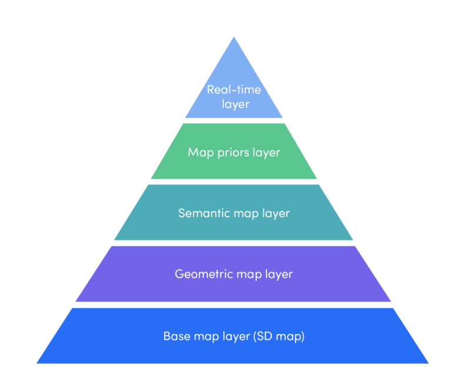

# Lecture 3: Mapping and Localization

## Agenda
- Housekeeping tasks
- Recap sensors and re-explain whatever was glossed over last time
- HD Maps: What are they, how they are created, types, and what are they used for
- Concept of Localization
- Histogram Filter Localization (?)

## Notes

### Housekeeping
- How are the reading responses going?
- Lecture Feedback (again)

---
### Recap
- Brief Recap on See-Think-Act and where we are so far... (roadmapping)
- Recap discussion on sensors
    - "Talked about pros and cons of various sensors so far..."
- Talk a little bit more about Cameras vs Lidar
    - What is the big debate in the AV community? Why is this important?
    - Why Elon Musk hates LiDAR... LiDAR as a "crutch"... dig deeper -- what are the business incentives at play?
    - A little bit more about Solid State LiDAR and how it will make LiDAR cheaper!
        - Someone asked last time about what is being done to make LiDAR cheaper --> address directly!
- Address question from last time about what range of EM spectrum LiDAR uses
    - 600-1000nm, but also 1550 nm (eye-safe at high power levels)
    - depends on what is safe for eye, and how powerful you can make it... tradeoffs
- Address question about what if LiDAR doesn't bounce off walls and reach receiver?

---

### Mapping Basics and Representations [[ref](https://www.coursera.org/learn/robotics-learning)]

What is a Map?
- Map is a spatial model of a robot's environment
- Mapping is the process for building a map
- Considerations:
    - Map representations (coordinate system, detail)
    - Available sensors
    - Purpose? (globally consistent? Local collision-avoidance? Navigation?)

Types of Maps
- Metric Map
    - e.g. map of the world
    - location represented as a coordinate (x,y,...)
- Topological Map
    - e.g. Subway map
    - Geometric scale NOT correct! But we don't care about the precise locations of all relevant objects...
    - Locations represented as nodes, and connections as arcs (they may have weights)
    - Purpose: show connections between objects
    - Useful for path planning
- Semantic Map
    - map with labels (annotated)
    - high level on granularity for recognition of different objects (need to know what everything is)

Why is Mapping Challenging?
- Mapping is a perception problem -- finding what is where from sensor readings. Reliance on sensors implies --> 
    - Noisy Measurements
    - Measurements are in robot's (local) coordinate frame. We need to translate this into global (world) frame.
- Motion involved (mapping happens while robot is moving around)
- Dynamic environment (state of the world changes over time)

Occupancy Grid Mapping
- Occupancy == binary random variable --> 0 or 1
- Occupancy grid map is a 2d array of occupancy variables, i.e. a fine-grained grid map where each cell is an occupancy variable
- Requires Bayesian Filtering algorithm to maintain the map
    - recursively update P(cell is occupied) for each cell
    - use probabalistic notion of occupancy instead of occupancy itself
- 1) Prior Map (map has probabilities)
- 2) Measurement model
    - shoot a laser at a cell from the robot... see if it hits or not (0 or 1)
    - possibilities: true occupied, false occupied, true empty, false empty
- Bayes Rule: P(cell is occupied | measurement) = P (measurement | cell is occupied) * P(cell is occupied) / P (measurement)
- Log odd update...
    - Instead of storing all the probabilities, create a function called "odd" which is the ratio of occupied to free probabilities, and use the log of that --> makes math simpler
- Update Rule
    - Update is done for only observed cells
    - Updated values become priors when you receive new measurements in future time steps -> update becomes recursive
- Example
    - start with a measurement model (prob of occ and prob of free), and an initial map (all probs initialized to 0.5 i.e. unknown)
    - First emit a ray to a single cell
    - For cells observed (measured) to be occupied, update probability by occupied prob; for cells observed to be free, update probability by free prob.

Coordinate Frames
-  Need to transform from robot's local reference frame to global reference frame -- use pose of robot and match up
- introduce idea of pose...?

3D Mapping Representations
- Discrete Occupancy Grid Map Representation (as before)
    - Pros: 
        - Immediate access to a cell
    - Cons: 
        - Requires Large Memory (scales up as you add more cells or reduce the size of each cell to increase detail) --> blows up when you add another dimension (3D)
        - Loss of information due to discretization
- What if we keep just a list of occupied points?
    - Pros: Requries less memory, no need for discretization (maybe you can just capture all occupied _points_, not cells)
    - Cons: Takes very long to search!! --> blows up in 3D
    - Maybe solve with tree representation?
- Tree Data Structure
    - kd tree or octree (2 x 2 x 2)
        - Split up world into octants and represent points in branched octants

---

### Mapping for the Real World [[ref](https://medium.com/@LyftLevel5/https-medium-com-lyftlevel5-rethinking-maps-for-self-driving-a147c24758d6)]

- HD Maps are different than traditional map services that are used for navigation (Google Maps, etc)... they provide 1-2 orders of magnitude more resolution (10m -> 10cm)
- Richness of info, how info is collected, etc varies by company and purpose
- "HD map as a specialized component in the autonomy stack" --> integration with rest of AV Stack
    - Develop HD Maps tailored towards your purpose (AR Application? Helping a human drive aka L2? Full self-driving?)
    - Tightly integrate with AV stack

HD Map Principles
- Mapping as Pre-Computation
    - "In some cases, this pre-computation can result in completely solving sub-parts of the autonomy problem"
        - E.g. Perception and Localization of completely static objects (roads, intersections, street signs, etc) --> background subtraction
        - Human operators (technicians) can help with this by processing/cleaning sensor data and translating it into map
    - Even if you can't perceive and localize _everything_ ahead of time, it helps you build a __map prior__ (probabilities about dynamic parts of the world)
    - How do you index, store, organize, query, and retrieve this map data (prior)?
- Mapping to Improve Safety
    - Speed limit info for lane segments, etc.
- Maps as a Unique Sensor
    - Compared to other sensors, it has no range limitations -- can sense beyond the 100-200m range typical of today's AV sensors
    - Overlay the other runtime sensor data onto existing map prior
    - "Immune to runtime occlusion from dynamic objects"
    - "Design more efficient map access patterns and integrate the map data more naturally into the autonomy stack"
- Maps as a Global Shared State
    - AV's read and write to global map --> sharing of real-time info between AVs in fleet
    - Fleet collectively adds to the data structure, making it more robust
    - Available at every level of the AV stack -- shared state data that can be used for any purpose across the whole stack (e.g. perception wants to know stop signs? you got it. Motion planning wants to know occluded garage locations? Check. etc...)

Mapping Vehicles
- Maps are built using the same vehicles which the autonomy software will then be run on --> consistency
- Map build data collection runs are done in manual mode, subsequent runs in autonomy mode -- that's the only difference
- Can also run other parts of the stack while you're collecting these maps (e.g. perception to detect and remove dynamic objects that won't be part of the built map, and localization to figure out which parts of the map are stale from previous runs and need to be updated)

Layered Map

- 
- Base Map Layer (SD Map)
    - More or less what you get from Google Maps -- it's a good starting point to flesh out your HD Map
- Geometric Map Layer
    - "contains 3D information of the world"
    - raw sensor data (cameras, lidar, ...) processed using SLAM during the initial data collection run --> aligned point cloud produced --> post-processed to produce derived map "objects" that are stored in the geometric map
        - ground map to identify the ground (from segmentation algorithms) and classify as "driveable" surface
        - segment point cloud into small chunks as well
- Semantic Map Layer
    -  adds "semantic objects" -- lane boundaries, intersections, crosswalks, parking spots, traffic lights, etc
    - __Rich Metadata__ associated with objects (e.g. speed limits associated wtih lane segments, bounding boxes, etc)
    - Use some algorithms to understand and hypothesize what these semantic objects are, but lot of annotation work goes to human technicians
    - connectivity graphs and structural/organizational solutions
- Map Priors Layer
    - Derived information about dynamic elements and human driving behavior
        - e.g. order of traffic light rotations
    - approximate hints to autonomy (heuristics)... not exact!
- Real-time Knowledge Layer
    - read/write capable, only layer that can be updated while map is in use by AV (on a real ride)
    - real-time traffic info, construction, etc.
    - support "gathering and sharing of real-time global info" amongst AV fleet
- each layer is built independently and data is transmitted across layers
- alignment algorithms stitch layers together to build one singular "HD MAP"

---

### Pose
- Reference Frames
    - Robot Reference Frame
    - Global Reference Frame
    - Other frames
- Two Components: all poses can be represented as a combination of those two
    - Translation
    - Rotation
- Representations:
    - Euler Angles
    - Roll-Pitch-Yaw
    - Quaternions
    - Homogeneous Transformations...
- __6 Degrees of Freedom__
    - 3 translational (x, y, z) and 3 rotational (roll, pitch, yaw)
    - train? 1 DoF
    - car? 3 DoF (x, y, rotation)?
    - rigid bodies have 6DoF ... but this could get more if there are multiple joints (DoFs add up) or less depending on the plane upon which the robot is operating

### Localization
- Concept -- we need to find out where we are!
- [Sherlock Holmes Video](https://www.youtube.com/watch?v=5DVJEQEdo-c)
- We have a map... and we have our robot! What would we like to do?
    - Find out where we are on the map!
    - Less importantly, find out where other "relevant things" are on the map (if possible)...

Dead Reckoning
- Quick and dirty way for localization
- Just measure the wheels! Wheel encoders
- Cumulative errors
    - errors do not scale linearly -- they scale quadratically or exponentially!
- Environmental factors -- skidding, etc.

Basics of Histogram Filter
- Walk through the basic predict-update example
- 
