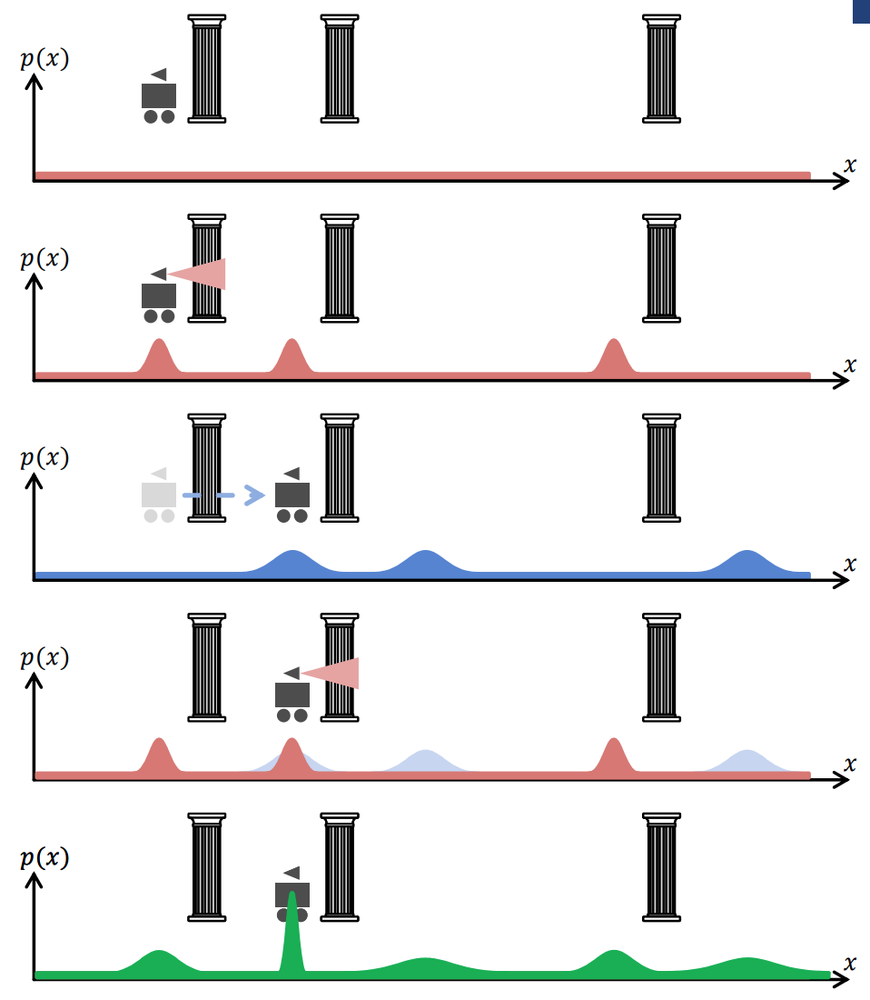

# Lecture 4: Localization

## Agenda
- Housekeeping tasks
- Recap mapping and re-explain whatever was glossed over last time, including dead reckoning
- Revisit histogram filter example
- Introduce Bayesians and Gaussians
- Understand histogram filter formally
- Particle filter algorithm
- Kalman Filter?

## Notes

### Housekeeping
- How are the reading responses going?
- Feedback on denseness of last lecture (as compared to engaging sensors lecture)? Make more engaging or want to learn more info?
    - Goal is to help everyone logically follow and arrive at concepts themselves by building off previous concepts, not to deliver boring data (flow!)

---

### Recap: Mapping (2min)
- Re-emphasize Layered Mapping in industry
- Re-emphasize geometric challenges

---

### Recap: Pose and Dead-Reckoning (3min)
- What is Pose? Just a location -- goal is to represent localization in some formal way
- 6DoF pose is what we want
- Dead-reckoning -- revisit motivation
    - Loss of GPS
    - Use wheel odometry
    - Re-emphasize __cumulative errors__!

### Recap: Re-introduce Probabilistic Localization (3-5min)
- Walk through Bayesian example again
- 
- ask questions and make sure everyone understands this predict-update cycle concept
    - build intuition!!

---